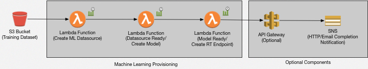

# node-demand-predictor

## Overview

This app when passed a specific json dataset containing training data will convert said file to csv before using it to train a linear regression model using AWS Machine Learning. It will ultimately return an HTTP endpoint to be used for predicting node counts given a particular demand value.

The focus when building this app was around usability, function, security and automation.

AWS SAM is used for packaging, CloudFormation is used for deployment of the basic infrastructure and Lambda (Python) is used for orchestrating the creation of the model and subsequent prediction endpoint.

## Arch Diagram

## Installation

To deploy the app run the following commands:

* `aws cloudformation package --template-file node-predictor.yaml --output-template-file sam-output.yaml --s3-bucket <package-bucket-name>`
* `aws cloudformation deploy --template-file sam-output.yaml --stack-name <stack-name> --parameter-overrides BucketName=<datasource-bucket-name> --capabilities CAPABILITY_IAM`

where:
* `<package-bucket-name>` - name of an S3 bucket you have access to in order for SAM to package the code for deployment via CloudFormation. Versioning must be enabled.
* `<datasource-bucket-name>` - name of a new S3 bucket to be created by the deployment.
* `<stack-name>` - the desired CloudFormation stack name.

The infrastructure deployment takes about a minute to complete. Once done upload a `sample.json` in the root of `<datasource-bucket-name>`.

The model build process takes ~12 minutes to complete. Once done go to ML Model created in  https://console.aws.amazon.com/machinelearning/home? and use the real-time prediction endpoint to query for desired nodes.

## Obtaining Predictions
There's a couple ways to obtain a prediction:

1. From the Management Console navigate to the ML page and run the predictions from within the Model.
2. Use the AWS CLI `aws machinelearning predict`

## Todo
* Build API Gateway to ease accessibility of the tool
* Hook up SNS to notify caller that prediction endpoint is ready for calling
* Orchestrate the existing Pollers with Step Functions to simplify and reduce some of the existing built in complexity
